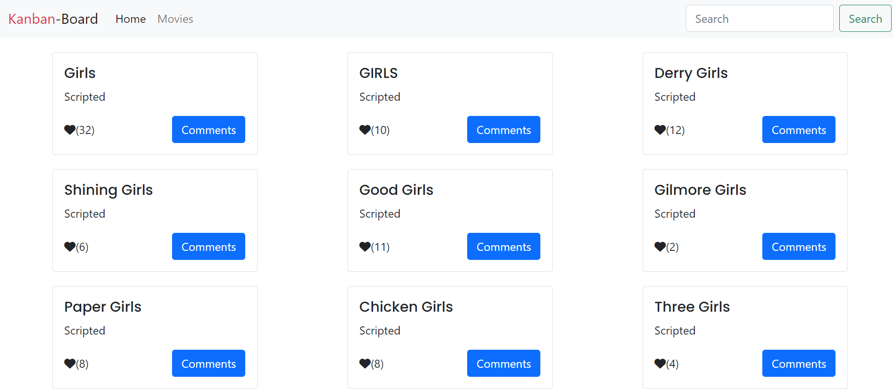

# JavaScript capstone project

This is an API-based App. A Microverse JavaScript Capstone project. It is about building a web application based on an external `API`. We used the following two `APIs`:
[x] [TVmaze API](https://www.tvmaze.com/api) - For data about TV series and movies
[x] [Involvement API](https://www.notion.so/microverse/Involvement-API-869e60b5ad104603aa6db59e08150270) - To record the different user interactions (likes, comments and reservations)

## Built With

[x] Major languages - `HTML`, `CSS`, `SASS` and `JavaScript`
[x] Frameworks - `Webpack`, `Bootstrap`, `Jest`, `JSON` and `Nodejs`
[x] Technologies used - `ES6 Modules`, `Callbacks/Promises`, `Gitflow` and `APIs`

## Live Demo

[Live Demo Link](http://edwardodhiambo.me/JavaScript-Capstone/)
[Video Demo Link](https://www.loom.com/share/9af1832d540c45828082c64199bd836b)

## Getting Started

Use this url to clone the repo on your terminal: https://github.com/white3d/JavaScript-Capstone.git

After cloning the repo, change dir to the project folder then run the following:

- [x] `npm install`
- [x] `npm run build`
- [x] `npm start`

Hurray!!! You are now good to go.
## Authors

👤 **Author1**

[Portfolio Website](https://edwardodhiambo.me/My-Portfolio/)

- GitHub: [@whit3d](https://github.com/white3d)
- Twitter: [@odhiambo_ed](https://twitter.com/odhiambo_ed)
- LinkedIn: [Edward Odhiambo](https://www.linkedin.com/in/edward-odhiambo-6a462a21b/)

👤 **Author2**

[Portfolio Website](https://theophileaseh.github.io/)

- GitHub: [@Theophileash](https://github.com/Theophileaseh)
- Twitter: [@NwachanT](https://twitter.com/NwachanT)
- LinkedIn: [LinkedIn](https://linkedin.com/in/nwachan-theophile-342274172)

## 🤝 Contributing

Contributions, issues, and feature requests are welcome!

Feel free to check the [issues page](https://github.com/white3d/JavaScript-Capstone/issues).

## Show your support

Give a ⭐️ if you like this project!

## Acknowledgments

- Hat tip to anyone whose code was used
- Inspiration
- etc

## 📝 License

This project is [MIT](./MIT.md) licensed.
